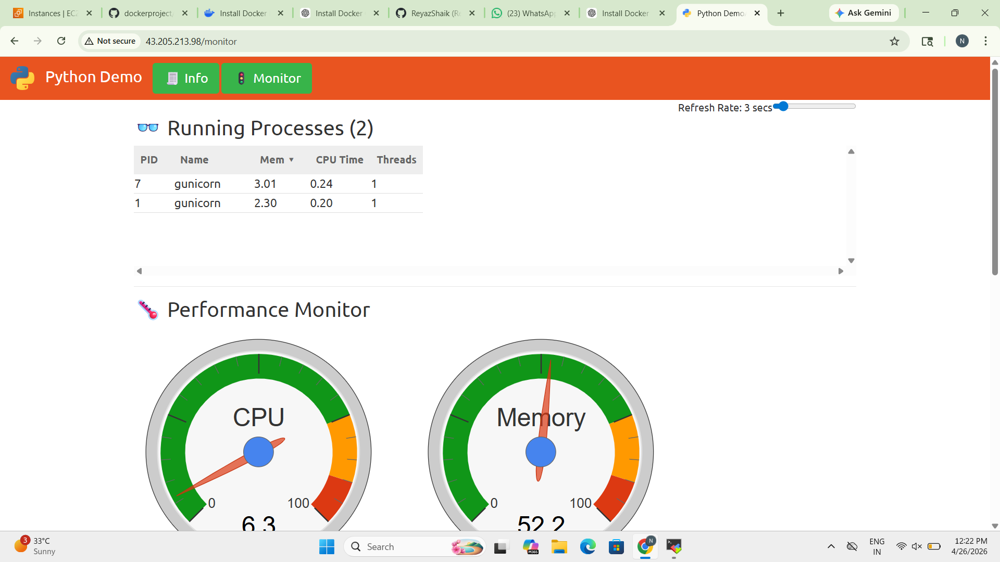

# 🚀 Docker Multi-Service Application with Nginx Reverse Proxy

## 📌 Project Overview

This project demonstrates a **real-world DevOps deployment** of a multi-container application using Docker Compose.
Multiple services are containerized and exposed through an **Nginx reverse proxy**, all deployed on an AWS EC2 instance.

---

## 🧱 Architecture

The application consists of the following services:

* 🏦 **Internet Banking Service**
* 📱 **Mobile Banking Service**
* 🛡️ **Insurance Service**
* 🌐 **Nginx Reverse Proxy** (routes traffic to services)

---

## 🛠️ Tech Stack

* Docker
* Docker Compose
* Nginx
* AWS EC2
* Python (Gunicorn-based app)

---

## 🚀 Key Features

* Multi-container architecture using Docker Compose
* Reverse proxy routing using Nginx
* Real-time CPU & Memory monitoring dashboard
* Deployed on AWS EC2 with public access
* Scalable and modular design

---

## ⚙️ How to Run

```bash
docker compose up --build -d
```

---

## 🌐 Live Demo

* Main Application: http://43.205.213.98
* Monitoring Dashboard: http://43.205.213.98/monitor

---

## 📊 Monitoring Dashboard

This dashboard displays real-time CPU and memory usage of the application running inside Docker containers.



---

## 📁 Project Structure

```
.
├── Dockerfile
├── docker-compose.yml
├── nginx.conf
├── README.md
├── screenshot.png
```

---

## 💼 What I Learned

* Containerizing applications using Docker
* Managing multi-container setups with Docker Compose
* Configuring Nginx as a reverse proxy
* Deploying applications on AWS EC2
* Troubleshooting networking and container issues

---

## 🔮 Future Improvements

* Add CI/CD pipeline (GitHub Actions / Jenkins)
* Implement HTTPS using SSL certificates
* Add domain name routing
* Integrate logging and monitoring tools

---

## 👨‍💻 Author

**Nazeem Pasha**
Aspiring DevOps Engineer

---

## ⭐ Acknowledgment

This project is part of hands-on learning to build real-world DevOps skills and deployment experience.
